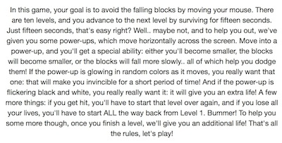
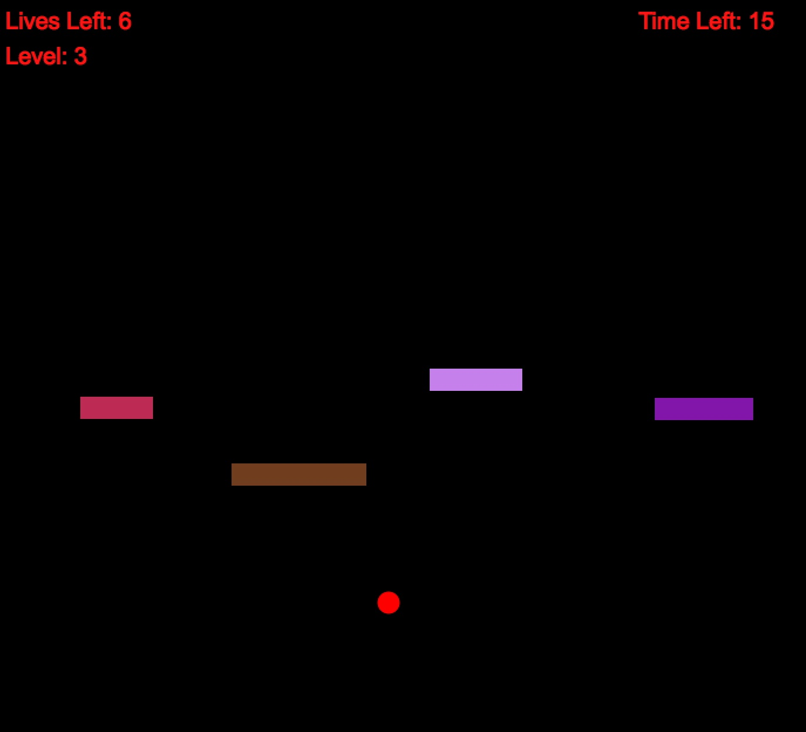
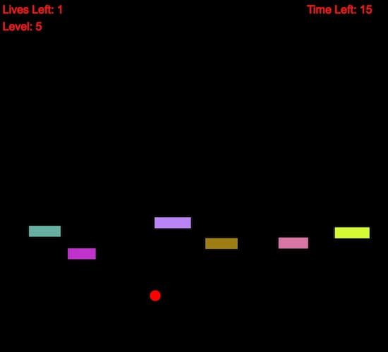
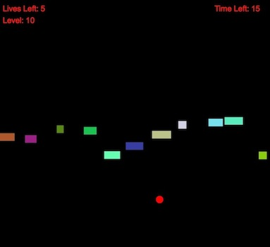

DropBlox
========

## Overview

DropBlox is a fun and addicting in-browser game built using [Processing.js](http://processingjs.org/). Using your mouse,  you try to dodge falling blocks and advance to the next level. The levels get harder and harder, so there are power-ups to help you along the way. Good luck!

## Gameplay

When you first start the game, you'll be greeted by the following welcome screen:



As the prompt says, you avoid the falling blocks by moving your mouse. There are ten levels, and you advance to the next level by surviving for fifteen seconds. There are also power-ups, which move horizontally across the screen. There are five types of powers you can get with power-ups:

- You become smaller, so you can more easily maneuver between the falling blocks.
- The blocks become smaller, so you can more easily dodge them.
- The blocks fall more slowly, so you have longer to react to them and can thus dodge them more easily.
- You become invincible! Those blocks got nothing on you now.
- You get an extra life! Woohoo!

You'll know the power is invincibility or an extra life if the horizontal power-up is glowing in random colors as it moves or if it is flickering black and white, respectively. All other power-ups can be any of the first three powers, you won't know which til you get it!

We'll help you out even more too; you'll get an additional life every time you advance to a new level.

## Preview

Here's what the game looks like. You'll be controlling the red dot and trying to avoid the falling blocks.



Not too hard, huh? Let's turn up the difficulty.



Still not impressed?



Good luck!

## Your Turn to Play

Clone this repo by running the following command:
```
$ git clone git://github.com/nsax91/DropBlox.git
```
Then, open index.html in Firefox or Safari (Chrome unfortunately not supported yet) and you're on your way!
